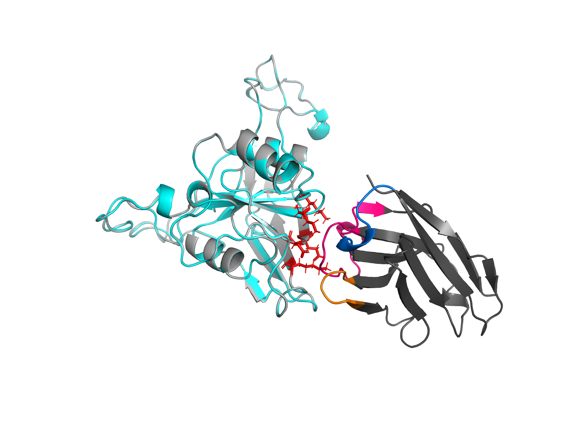
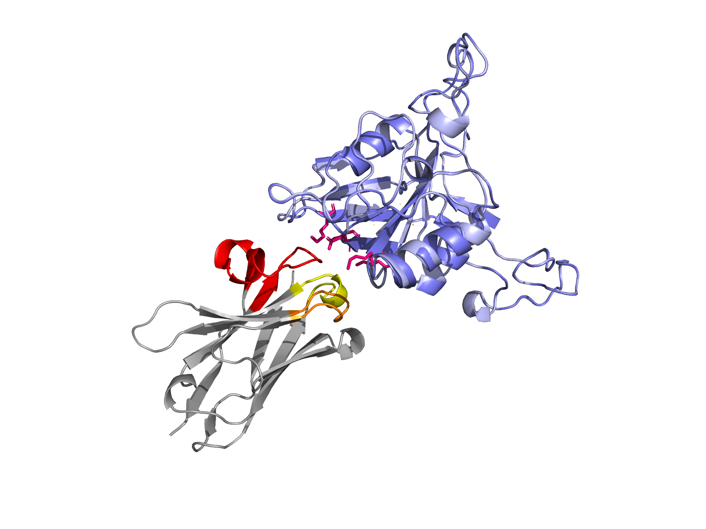

# De Novo Nanobody Design Targeting PSMA

A computational campaign designing single-domain antibodies (VHH / nanobodies)
against the apical-domain epitope of PSMA, a validated prostate cancer target,
using RFantibody (RFdiffusion + ProteinMPNN + RoseTTAFold2).

## Summary

This project ran the full RFantibody pipeline end to end against a chosen PSMA
epitope, in two phases:

- **Phase 1, proof-of-concept:** a 4-design run to validate the workflow
  (target prep, backbone design, sequence design, structure-prediction
  filtering), shake out failure modes, and build the judgment to evaluate
  designs. It confirmed the pipeline works and surfaced two important findings:
  a target-renumbering issue in the outputs, and a hint that CDR-H3 length
  affects whether a design reaches the epitope.
- **Phase 2, scaled experiment:** a 192-design, two-batch campaign that turned
  the Phase 1 hint into a controlled test of how CDR-H3 length affects design
  success, and produced a verified headline design whose CDR-H3 folds directly
  over all five chosen hotspot residues.

The pipeline was later rebuilt to run locally on a Blackwell (RTX 5060 Ti,
CUDA 12.8) GPU, and the campaign re-run on that build to confirm it reproduces
the original cloud results. See [Local build reproduction](#local-build-reproduction).

Target: PSMA (GCPII / FOLH1) extracellular domain, PDB 4NGM. Epitope: apical
domain, the validated binding region of the clinical antibody J591. Format:
single-domain VHH nanobody. Compute: cloud RTX 4090 via RunPod for the original
campaign; local RTX 5060 Ti for the reproduction.

## Phase 1: proof-of-concept (4 designs)

A minimal 2-backbone x 2-sequence run to validate the pipeline end to end.

| Design               | pLDDT | Reached epitope? | CDR-mediated dock?  |
|----------------------|-------|------------------|---------------------|
| psma_nb_1_dldesign_1 | 0.912 | Yes (~8 A)       | Partial, poor angle |
| psma_nb_1_dldesign_0 | 0.921 | Yes (~8 A)       | No (framework dock) |
| psma_nb_0_dldesign_0 | 0.913 | No (~18 A)       | -                   |
| psma_nb_0_dldesign_1 | 0.905 | No (~18 A)       | -                   |

All four fold confidently (pLDDT > 0.90), but pLDDT reflects fold confidence,
not binding. Only one backbone placed its loops near the epitope, and none is a
convincing binder, which is expected at this scale. Two things made this run
worth more than its four designs: it caught a target-renumbering bug in the
pipeline outputs (see methods), and its one long-H3 backbone (H3 length 20)
missed the epitope while the shorter one (H3 length 11) reached it. With only
two backbones that is a hint, not a result, which is exactly what motivated
Phase 2.

## Phase 2: the two-batch H3-length experiment

Two batches of 96 designs each, differing only in the CDR-H3 length range
sampled, to properly test the Phase 1 hint: natural camelid VHHs carry long
CDR-H3 loops, so does sampling longer H3s help or hurt de novo design against
this epitope?

| Batch  | H3 range | Passed 8 A hotspot filter | Best iPAE | Median iPAE |
|--------|----------|---------------------------|-----------|-------------|
| batchA | 5-15     | 53 / 96                   | 13.89     | 18.65       |
| batchB | 8-20     | 64 / 96                   | 5.27      | 18.33       |

batchB (longer H3) won on both axes: a higher geometric pass rate and a
dramatically better best-interface confidence. The gap is starkest at the top
end. batchA's single best design (iPAE 13.89) would not clear the iPAE < 10
"promising" threshold that batchB cleared six times. batchB produced a cluster
of five designs under iPAE 8, not a lone outlier:

| Design               | iPAE | pLDDT | min hotspot dist (A) | H3 len |
|----------------------|------|-------|----------------------|--------|
| batchB_90_dldesign_1 | 5.27 | 0.91  | 4.69                 | 16     |
| batchB_27_dldesign_0 | 6.97 | 0.90  | 4.52                 | 12     |
| batchB_11_dldesign_0 | 7.10 | 0.91  | 4.12                 | 13     |
| batchB_20_dldesign_0 | 7.41 | 0.91  | 4.55                 | 10     |
| batchB_29_dldesign_1 | 7.66 | 0.91  | 5.12                 | 11     |

Structural rationale: a longer H3 gives the loop more reach to extend from the
framework into the epitope. Note the interesting tension with Phase 1, where the
long-H3 backbone missed: within this winning cluster the H3 lengths span 10-16,
so H3 length does not cleanly predict quality at the single-design level. The
effect is real as a *distributional* shift between sampling ranges, not as a
per-design rule. That is precisely why a controlled two-batch comparison was
needed rather than reading anything into Phase 1's two backbones.

## Headline design

**batchB_90_dldesign_1** - iPAE 5.27, pLDDT 0.91, min hotspot distance 4.69 A,
H3 length 16.

Visual inspection confirms the entire CDR-H3 loop folds directly over all five
hotspot residues (Glu-Asp-Lys-Lys-Lys). This is genuine CDR-mediated engagement
of the chosen epitope, not a framework-mediated dock or a near-miss: the metrics
and the structure agree. The interface figure at the top of this page shows this
design.

One honest caveat: target-aligned CDR RMSD is ~4 A, meaning RF2 predicts a pose
slightly shifted from the designed backbone, though it remains confident in the
interface. This is a strong in silico result and a starting hypothesis for
wet-lab work, not a validated binder.

## Local build reproduction

The RFantibody pipeline ships against CUDA 11.8, which does not support the
Blackwell (sm_120) architecture. The stack was rebuilt from source against
CUDA 12.8 to run locally on an RTX 5060 Ti, removing the dependence on rented
cloud GPUs. Build details are in the separate rfantibody-blackwell notes.

To confirm the local build produces equivalent science (a different CUDA
numerical stack and a newer RFantibody version could in principle shift
results), the Phase 2 batchB campaign was re-run locally with identical
parameters and compared against the original cloud run:

| Metric               | RunPod (cu118) | Local (CUDA 12.8, sm_120) |
|----------------------|----------------|---------------------------|
| Median iPAE          | 18.33          | 18.50                     |
| 8 A filter pass rate | 64 / 96        | 54 / 96                   |
| Best iPAE            | 5.27           | 4.78                      |

The median interface-pAE, the stable high-N statistic, is essentially identical
(18.50 vs 18.33), so the local build reproduces the campaign's interface-quality
distribution. The pass-rate difference (54 vs 64) sits within binomial sampling
noise on the softer geometric filter and does not reflect a quality shift. The
known target-renumbering behaviour persisted identically on the local build,
handled the same way (structural mapping, not trusting output residue numbers).

Applying the same structural triage as the original campaign: the top design by
iPAE (4.78) was a framework-mediated dock, flagged by a large target-aligned CDR
RMSD (27.8 A) and confirmed by inspection, confident interface, wrong paratope.
Ranking instead on iPAE together with pose agreement surfaced a genuine
CDR-mediated candidate, **samples_design_0_dldesign_0** (iPAE 8.81, CDR RMSD
6.42 A, min dist 4.47 A, H3 length 21), whose CDR-H3 engages the epitope at a
natural angle (shown above). This is presented as evidence the local build works
and yields the same kind of output under the same scrutiny, not as a new headline
result.

## Key result in context

This is an in silico campaign. High pLDDT reflects fold confidence, not binding;
the interface pAE (iPAE) and hotspot-contact geometry are what separate a
productive design from a confident-but-useless one. A real path to a binder
would add orthogonal structure prediction, Rosetta interface scoring,
developability triage, cross-reactivity screening against the GCPIII homolog,
and ultimately wet-lab expression and binding assays. None of that is done here.

Full methodology for both phases, the two-batch analysis, the target-renumbering
QC finding, the local-build validation, and an honest assessment are in
[docs/methods-and-results.md](docs/methods-and-results.md).

## Repository

- `targets/` - input structure (4NGM crop), cleaned target, epitope/hotspot session
- `designs/poc/` - the four Phase 1 proof-of-concept designs and figure
- `designs/top/` - the six curated Phase 2 designs, the headline interface figure,
  and the local-build validation figure
- `scripts/` - the RunPod funnel (`run_batch.sh`, `analyze_batch.py`) and the
  local quiver-native tooling (`run_batch_local.sh`, `analyze_batch_local.py`,
  `cdr_annotate.py`)
- `results/` - `batch_analysis.csv`, the full per-design metrics table
- `docs/` - full methods and results, plus a PyMOL command reference

Raw design outputs (hundreds of PDBs per batch) are kept locally and excluded
from the repo; the curated top designs and the full metrics CSV are included so
the results are reproducible and inspectable without the bulk.
