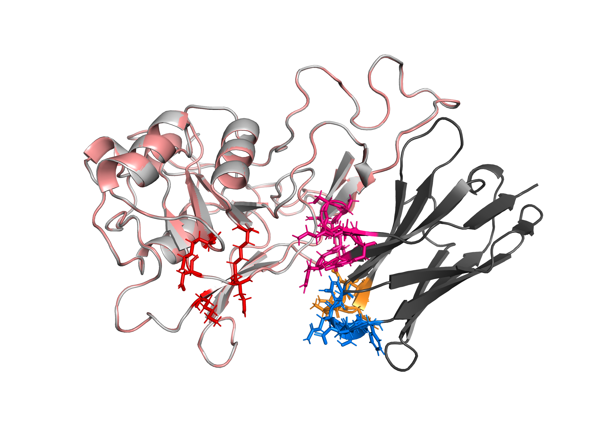

# De Novo Nanobody Design Targeting PSMA

A proof-of-concept computational campaign designing single-domain antibodies
(VHH / nanobodies) against the apical-domain epitope of PSMA, a validated
prostate cancer target, using RFantibody (RFdiffusion + ProteinMPNN +
RoseTTAFold2).

## Summary

Built and ran the full RFantibody pipeline end to end against a chosen PSMA
epitope: target preparation, backbone design, sequence design, and
structure-prediction filtering. Generated and critically evaluated de novo
nanobody designs, including identifying and correcting a target-renumbering
issue in the pipeline outputs.

Target: PSMA (GCPII / FOLH1) extracellular domain, PDB 4NGM. Epitope: apical
domain, the validated binding region of the clinical antibody J591. Format:
single-domain VHH nanobody. Compute: cloud RTX 4090 via RunPod (the local
Blackwell GPU is not supported by RFantibody's CUDA 11.8 container).

## Key result

| Design               | pLDDT | Reached epitope? | CDR-mediated dock?  |
|----------------------|-------|------------------|---------------------|
| psma_nb_1_dldesign_1 | 0.912 | Yes (~8 A)       | Partial, poor angle |
| psma_nb_1_dldesign_0 | 0.921 | Yes (~8 A)       | No (framework dock) |
| psma_nb_0_dldesign_0 | 0.913 | No (~18 A)       | -                   |
| psma_nb_0_dldesign_1 | 0.905 | No (~18 A)       | -                   |

This was a 4-design proof-of-concept to validate the workflow, not a production
campaign. All four designs fold confidently (pLDDT > 0.90), but pLDDT reflects
fold confidence, not binding: only one backbone placed its CDRs near the
epitope, and none is a convincing binder, which is expected at this scale.

Full methodology, the target-renumbering QC finding, and an honest assessment
are in [docs/methods-and-results.md](docs/methods-and-results.md).

## Repository

- `targets/` - input structure (4NGM crop) and epitope/hotspot PyMOL session
- `designs/` - RF2 design structures, ProteinMPNN intermediates, and figures
- `docs/` - full methods and results, plus a PyMOL command reference